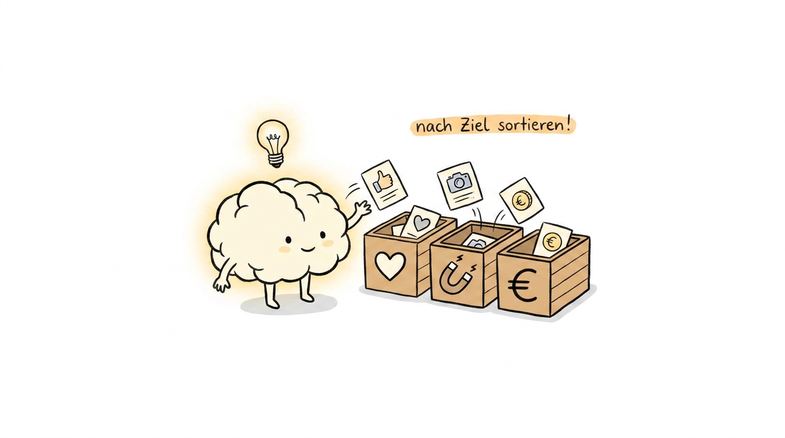

# 🧠 lumi-illustration-skill

**Deutscher KI-Illustration-Skill mit LUMI-Charakter für Social-Media-Content**
**German AI Illustration Skill with LUMI Character for Social Media Content**

> 🇩🇪 Erstelle konsistente, handgezeichnet wirkende Illustrationen für Instagram, Pinterest, YouTube und mehr – mit LUMI als zentralem Charakter.
>
> 🇬🇧 Create consistent, hand-drawn style illustrations for Instagram, Pinterest, YouTube and more – with LUMI as the central character.

---

## Was ist LUMI? / What is LUMI?

🇩🇪 LUMI ist ein stilisiertes Gehirn mit kleinen Ärmchen und Beinchen, das sanft leuchtet und immer eine Glühbirne über dem Kopf hat. LUMI ist kein Maskottchen – LUMI ist ein aktiver Teilnehmer in jeder Szene und erklärt komplexe KI-Konzepte auf charmante, nie kindische Weise.

🇬🇧 LUMI is a stylized brain with tiny arms and legs, glowing softly with a lightbulb always floating above its head. LUMI is not a mascot – LUMI is an active participant in every scene, explaining complex AI concepts in a charming, never childish way.

---

## Visuelles Konzept / Visual Concept

🇩🇪 | 🇬🇧
---|---
Reinweißer Hintergrund, viel Weißraum | Pure white background, lots of white space
Schwarze, handgezeichnet wirkende Linien | Black, hand-drawn style lines
Ein Bild = ein Gedanke | One image = one thought
Handschriftliche Annotationen in Rot, Orange oder Blau | Handwritten annotations in red, orange, or blue
Nicht corporate, nicht kindisch – quirky und clever | Not corporate, not cute – quirky and clever

---

## Skill-Dateien / Skill Files

Datei / File | 🇩🇪 Beschreibung | 🇬🇧 Description
---|---|---
`skill/lumi-ip.md` | LUMI Charakter-Definition | LUMI character definition
`skill/style-dna.md` | Visueller Stil & Regeln | Visual style & rules
`skill/composition-patterns.md` | Bildaufbau-Muster | Composition patterns
`skill/prompt-template.md` | Prompt-Vorlagen für alle Formate | Prompt templates for all formats
`skill/qa-checklist.md` | Qualitätskontrolle vor Veröffentlichung | Quality control before publishing

---

## Format-Dateien / Format Files

Datei / File | Format | 🇩🇪 Einsatz | 🇬🇧 Use case
---|---|---|---
`formats/instagram-post.md` | 1:1 | Instagram Feed | Instagram Feed
`formats/instagram-story.md` | 9:16 | Stories & Reels | Stories & Reels
`formats/pinterest-pin.md` | 2:3 | Pinterest | Pinterest
`formats/youtube-thumbnail.md` | 16:9 | YouTube | YouTube

---

## Schnellstart / Quick Start

🇩🇪 Basis-Prompt / 🇬🇧 Base Prompt:

```
LUMI brain character with tiny arms and legs, glowing softly with lightbulb above head,
[🇩🇪 DEINE AKTION / 🇬🇧 YOUR ACTION],
hand-drawn illustration style, clean black outlines, slightly wobbly lines,
pure white background, lots of white space,
small red handwritten German annotation "[🇩🇪 DEIN SCHLAGWORT / 🇬🇧 YOUR KEYWORD]",
quirky and clever, not childish, one core message, minimalist
```

---

## Modell-Empfehlungen / Model Recommendations

🇩🇪 Zweck | 🇬🇧 Purpose | Modell / Model
---|---|---
Test / günstig | Test / budget | imagen-nano-banana-2
Produktion | Production | gpt-1-5-high
Hochwertig | High quality | magnific-one-illustration

---

## QA-Checkliste / QA Checklist

🇩🇪 Vor dem Veröffentlichen prüfen / 🇬🇧 Check before publishing:

- 🇩🇪 LUMI sichtbar und aktiv? / 🇬🇧 LUMI visible and active?
- 🇩🇪 Hintergrund reinweiß? / 🇬🇧 Background pure white?
- 🇩🇪 Nur eine Kernaussage? / 🇬🇧 Only one core message?
- 🇩🇪 Kein PPT-Look? / 🇬🇧 No PPT look?

---

## Beispiele / Examples

### LUMI Charakter / LUMI Character


### Zwei Wendepunkte / Two Turning Points


### Ein Content, viele Formate / One Content, Many Formats


### KI-Workflow-Kette / AI Workflow Chain


### Ideen-Brunnen / Ideas Well


### Content-Presse / Content Press


### KI-Content reift / AI Content Ripens


### Mehr Content = Mehr Reichweite / More Content = More Reach


### Content nach Ziel sortieren / Sort Content by Goal


---

## Lizenz / License

MIT License

🇩🇪 Inspiriert von **[ian-xiaohei-illustrations](https://github.com/helloianneo/ian-xiaohei-illustrations)** von [@helloianneo](https://github.com/helloianneo) – vielen Dank für das großartige Konzept!

🇬🇧 Inspired by **[ian-xiaohei-illustrations](https://github.com/helloianneo/ian-xiaohei-illustrations)** by [@helloianneo](https://github.com/helloianneo) – many thanks for the great concept!

🇩🇪 Entwickelt von [LogiQore](https://github.com/LogiQore) für [ki-content-creator.de](https://ki-content-creator.de)

🇬🇧 Developed by [LogiQore](https://github.com/LogiQore) for [ki-content-creator.de](https://ki-content-creator.de)
