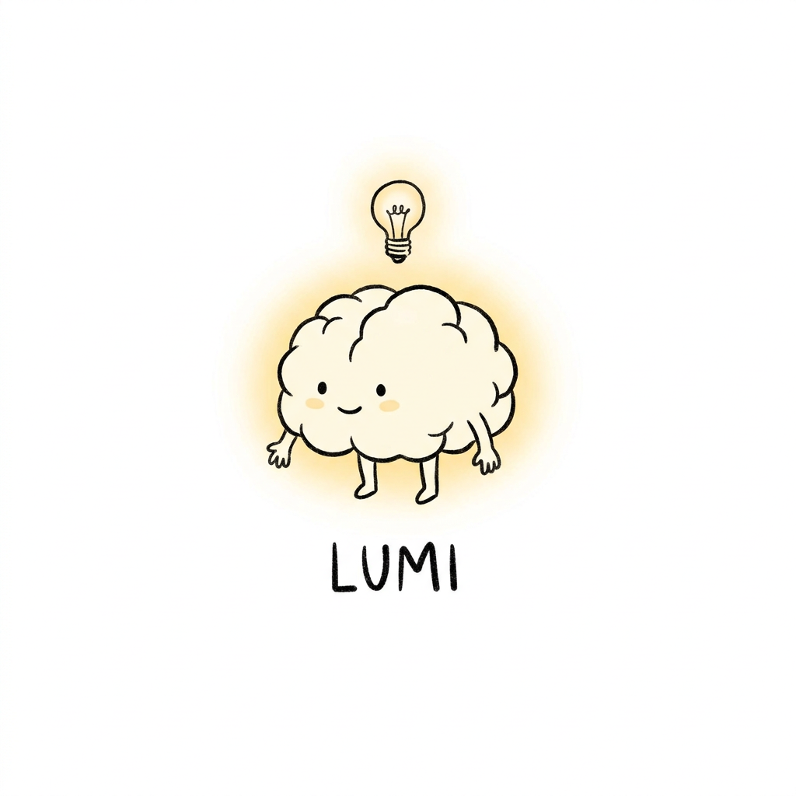
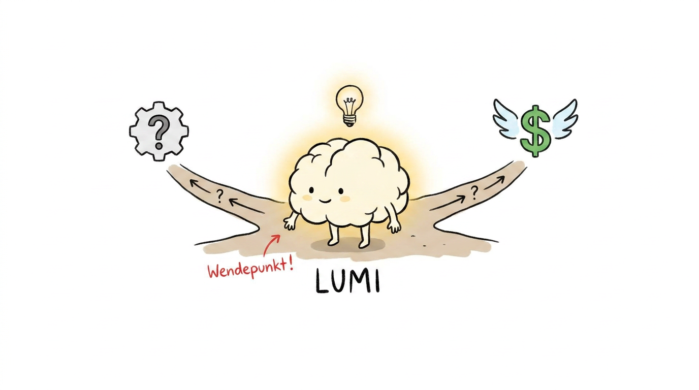
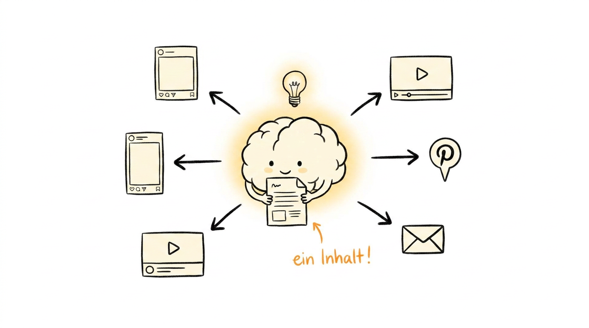
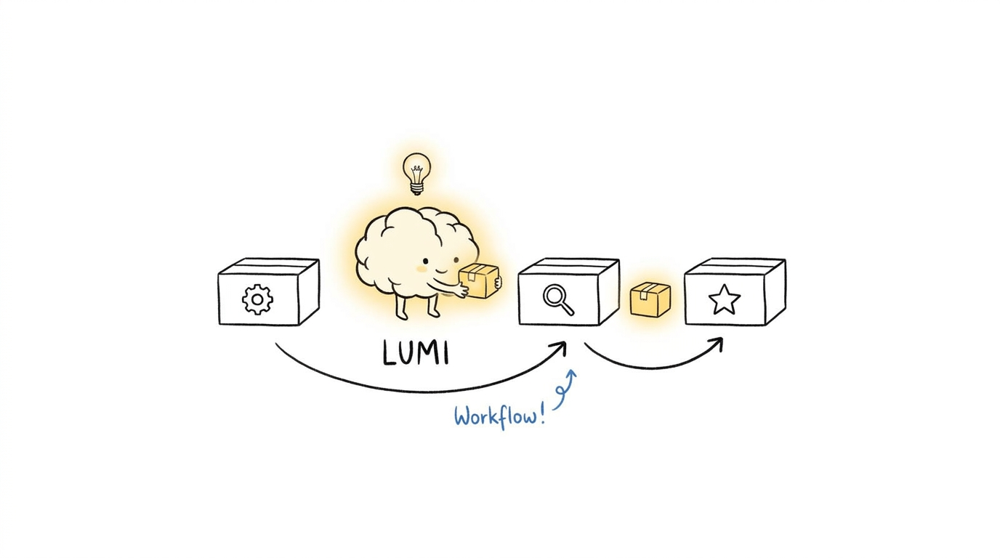
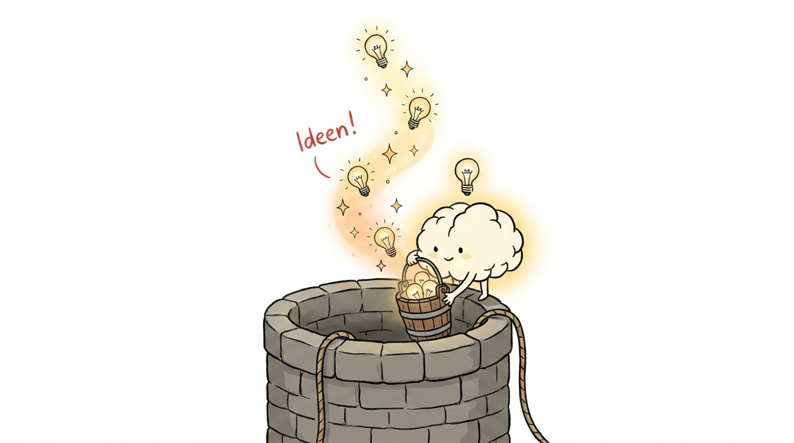
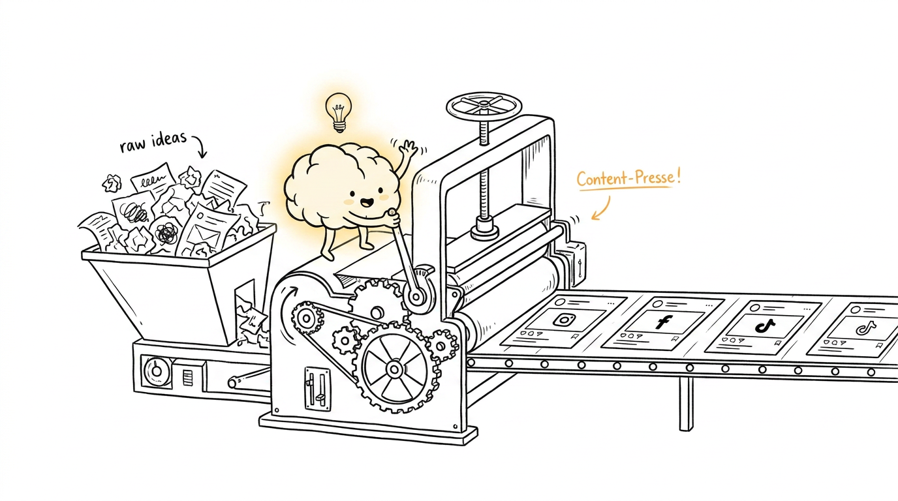
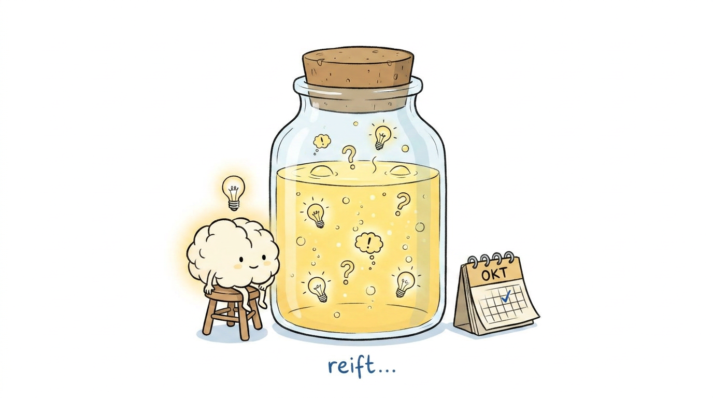
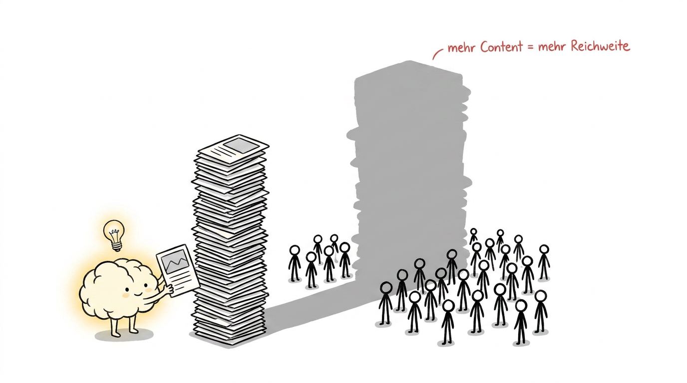

# 🧠 lumi-illustration-skill

**Deutscher KI-Illustration-Skill mit LUMI-Charakter für Social-Media-Content**
**German AI Illustration Skill with LUMI Character for Social Media Content**

> Erstelle konsistente, handgezeichnet wirkende Illustrationen für Instagram, Pinterest, YouTube und mehr – mit LUMI als zentralem Charakter.
>
> Create consistent, hand-drawn style illustrations for Instagram, Pinterest, YouTube and more – with LUMI as the central character.

---

## 🇩🇪 Deutsch

### Was ist LUMI?

LUMI ist ein stilisiertes Gehirn mit kleinen Ärmchen und Beinchen, das sanft leuchtet und immer eine Glühbirne über dem Kopf hat. LUMI ist kein Maskottchen – LUMI ist ein aktiver Teilnehmer in jeder Szene und erklärt komplexe KI-Konzepte auf charmante, nie kindische Weise.

### Visuelles Konzept

- Reinweißer Hintergrund, viel Weißraum
- Schwarze, handgezeichnet wirkende Linien
- Ein Bild = ein Gedanke
- Handschriftliche deutsche Annotationen in Rot, Orange oder Blau
- Nicht corporate, nicht kindisch – quirky und clever

### Skill-Dateien

| Datei | Beschreibung |
|---|---|
| `skill/lumi-ip.md` | LUMI Charakter-Definition |
| `skill/style-dna.md` | Visueller Stil & Regeln |
| `skill/composition-patterns.md` | Bildaufbau-Muster |
| `skill/prompt-template.md` | Prompt-Vorlagen für alle Formate |
| `skill/qa-checklist.md` | Qualitätskontrolle vor Veröffentlichung |

### Format-Dateien

| Datei | Format | Einsatz |
|---|---|---|
| `formats/instagram-post.md` | 1:1 | Instagram Feed |
| `formats/instagram-story.md` | 9:16 | Stories & Reels |
| `formats/pinterest-pin.md` | 2:3 | Pinterest |
| `formats/youtube-thumbnail.md` | 16:9 | YouTube |

### Schnellstart

```
LUMI brain character with tiny arms and legs, glowing softly with lightbulb above head,
[DEINE AKTION],
hand-drawn illustration style, clean black outlines, slightly wobbly lines,
pure white background, lots of white space,
small red handwritten German annotation "[DEIN SCHLAGWORT]",
quirky and clever, not childish, one core message, minimalist
```

### Modell-Empfehlungen

| Zweck | Modell |
|---|---|
| Test / günstig | imagen-nano-banana-2 |
| Produktion | gpt-1-5-high |
| Hochwertig | magnific-one-illustration |

---

## 🇬🇧 English

### What is LUMI?

LUMI is a stylized brain with tiny arms and legs, glowing softly with a lightbulb always floating above its head. LUMI is not a mascot – LUMI is an active participant in every scene, explaining complex AI concepts in a charming, never childish way.

### Visual Concept

- Pure white background, lots of white space
- Black, hand-drawn style lines
- One image = one thought
- Handwritten German annotations in red, orange, or blue
- Not corporate, not cute – quirky and clever

### Skill Files

| File | Description |
|---|---|
| `skill/lumi-ip.md` | LUMI character definition |
| `skill/style-dna.md` | Visual style & rules |
| `skill/composition-patterns.md` | Composition patterns |
| `skill/prompt-template.md` | Prompt templates for all formats |
| `skill/qa-checklist.md` | Quality control before publishing |

### Format Files

| File | Format | Use case |
|---|---|---|
| `formats/instagram-post.md` | 1:1 | Instagram Feed |
| `formats/instagram-story.md` | 9:16 | Stories & Reels |
| `formats/pinterest-pin.md` | 2:3 | Pinterest |
| `formats/youtube-thumbnail.md` | 16:9 | YouTube |

### Quick Start

```
LUMI brain character with tiny arms and legs, glowing softly with lightbulb above head,
[YOUR ACTION],
hand-drawn illustration style, clean black outlines, slightly wobbly lines,
pure white background, lots of white space,
small red handwritten German annotation "[YOUR KEYWORD]",
quirky and clever, not childish, one core message, minimalist
```

### Model Recommendations

| Purpose | Model |
|---|---|
| Test / budget | imagen-nano-banana-2 |
| Production | gpt-1-5-high |
| High quality | magnific-one-illustration |

---

## 🖼️ Beispiele / Examples

### LUMI Charakter / LUMI Character


### Zwei Wendepunkte / Two Turning Points


### Ein Content, viele Formate / One Content, Many Formats


### KI-Workflow-Kette / AI Workflow Chain


### Ideen-Brunnen / Ideas Well


### Content-Presse / Content Press


### KI-Content reift / AI Content Ripens


### Mehr Content = Mehr Reichweite / More Content = More Reach


---

## 📄 Lizenz / License

MIT License

Inspiriert von / Inspired by **[ian-xiaohei-illustrations](https://github.com/helloianneo/ian-xiaohei-illustrations)** von [@helloianneo](https://github.com/helloianneo) – vielen Dank für das großartige Konzept! / Many thanks for the great concept!

Entwickelt von / Developed by [LogiQore](https://github.com/LogiQore) für / for [ki-content-creator.de](https://ki-content-creator.de)
